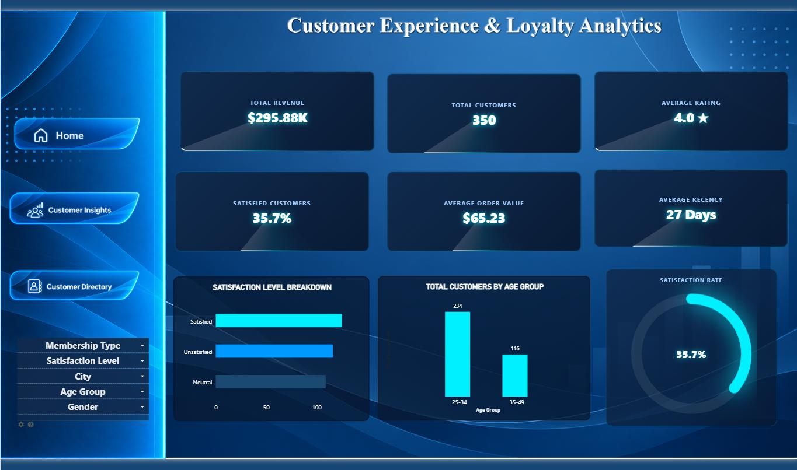
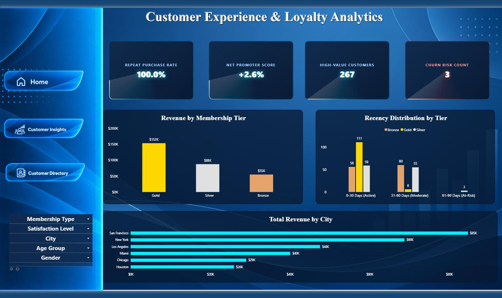
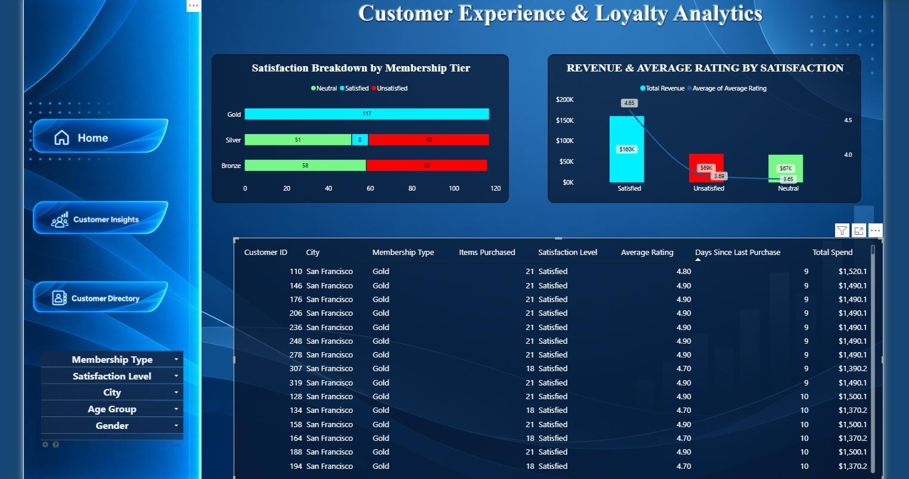

# Customer Experience & Loyalty Analytics 📊📊

An interactive **Power BI Dashboard** tracking customer satisfaction, loyalty membership tiers, ratings, revenue contributions, and detailed customer profiles to optimize customer retention strategies.

---

## 🌟 Key Insights & Features
- **Executive Summary (Home):** High-level view of core metrics, membership segmentation, and overall customer feedback.
- **Customer Insights:** In-depth analysis of satisfaction breakdown by membership tier (Gold, Silver, Bronze) alongside revenue and average rating correlations.
- **Customer Directory:** Granular, tabular view of individual customer profiles—including location, membership tier, items purchased, satisfaction levels, ratings, days since last purchase, and total spend.

---

## 📸 Dashboard Previews

### 1. Home Page

### 2. Customer Insights

### 3. Customer Directory

---

## 🛠️ Tech Stack & Tools
- **Business Intelligence:** Microsoft Power BI Desktop
- **Data Modeling:** DAX (Data Analysis Expressions) for customer metrics, average ratings, and retention calculations
- **Data Transformation:** Power Query / ETL
- **Data Source:** Customer demographics and transaction dataset (`/DATASETS`)

---
